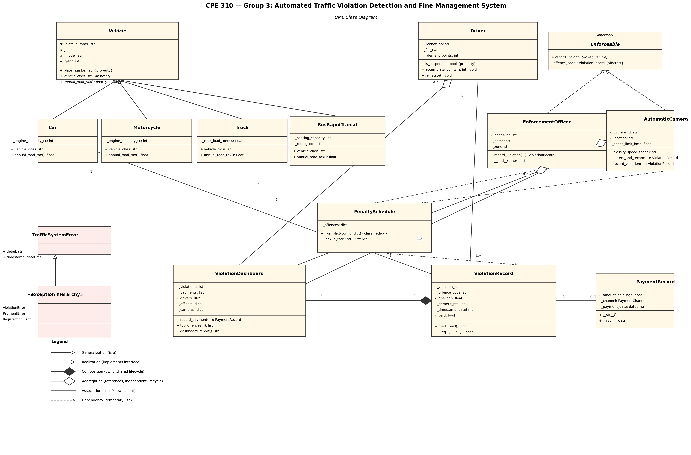

# Automated Traffic Violation Detection and Fine Management System

**CPE 310 — Object-Oriented Programming with Python | Capstone Project — Group 3 of 10**
**Department of Computer Engineering, Federal University Oye-Ekiti | 2025/2026 Session**

---

## 1. Project Title and Overview

Traffic law enforcement in Nigerian cities is largely manual, inconsistent, and prone to
dispute. This project is a Python OOP simulation of an automated traffic violation
management platform for a fictitious state transport authority (inspired by agencies such
as LASTMA and FRSC). The system classifies vehicles by type (car, motorcycle, truck, BRT
bus), records violations committed by registered drivers, computes fines from a
configurable 10-offence penalty schedule, tracks demerit-point accumulation through to
automatic licence suspension, supports both human enforcement officers and unmanned
speed cameras that auto-classify offences, validates fine payments, and produces
violation/revenue statistics for the authority. The system is a tested, documented
command-line application — no GUI or database is required by the brief.

## 2. Team Members

| # | Full Name | Matric Number | GitHub Username |
|---|---|---|---|
| 1 | Ani Ikenna Marvellous (Group Leader) | CPE/2023/1030 | _@Ani-IKENNA-MARVELLOUS_ |
| 2 | Anugwara Chiedoziem Chinonyerem | CPE/2023/1032 | _@MA-RK987_ |
| 3 | Aremu Oluwatomisin Ademide | CPE/2023/1033 | _@aremutomisin25-netizen_ |
| 4 | Ariyo Samuel Olamilekan | CPE/2023/1034 | @Ariyo001-maker_ |
| 5 | Babatunde Ebenezer Oluwagbenga | CPE/2023/1037 | _@Jerrybabs9336_ |
| 6 | Bamisile Oluwadarasimi Samuel | CPE/2023/1038 | _@nova1357_ |
| 7 | Banye Samuel Chukwuebuka | CPE/2023/1039 | _@sammyjay10py_ |
| 8 | Boluwade Olamiposi David | CPE/2023/1040 | _@boluwadedavid858-eng_ |
| 9 | Charles Princesuccess Ekom | CPE/2023/1041 | _@chalsprince01_ |
| 10 | Daniel Effiong Joseph | CPE/2023/1042 | _@danieleffiong059-wq_ |
| 11 | Oguntuase Ibukunoluwa Emmanuel | CPE/2021/1043 | _@Beetuyou_ |


## 3. OOP Concepts Demonstrated

| OOP Concept | Location in Code | Week |
|---|---|---|
| Class with constructor, docstring, `__str__`/`__repr__` | `src/vehicle.py`, class `Vehicle`, lines 21-87 | Week 1 |
| `@property` with regex validation | `src/vehicle.py`, `Vehicle.plate_number`, lines 38-50 | Week 2 |
| Strictly private attribute (name-mangled) | `src/driver.py`, `Driver.__demerit_points`, line 32 | Week 2 |
| Custom exception hierarchy with structured fields | `src/exceptions.py`, lines 16-78 | Week 2 |
| Abstract base class with abstract property + methods | `src/vehicle.py`, `Vehicle(ABC)`, lines 21, 66-75 | Week 3 |
| Abstract interface realised by two unrelated classes | `src/enforcement.py`, `Enforceable(ABC)`, lines 19-34 | Week 3 |
| `super()` used cooperatively in every subclass constructor | `src/vehicle.py`, `Car.__init__`, lines 97-103 | Week 3 |
| `@total_ordering` + `__eq__`/`__lt__`/`__hash__` | `src/violation.py`, `ViolationRecord`, lines 8, 91-103 | Week 4 |
| Operator overloading (`__add__`) | `src/enforcement.py`, `EnforcementOfficer.__add__`, line 114 | Week 4 |
| Duck typing / polymorphism (same call, 4 implementations) | `src/vehicle.py` `annual_road_tax()` demoed in `main.py` §6 | Week 4 |
| `__len__`, `__contains__`, `__iter__` on a collection class | `src/dashboard.py` lines 99-103; `src/penalty.py` line 87 | Week 4 |
| UML class diagram, 3-compartment notation, all 6 relationship types | `uml/class_diagram.png`, `uml/class_diagram.puml` | Week 5 |

## 4. System Architecture



The system is organised into three layers. The **reference-data layer**
(`Vehicle` hierarchy, `PenaltySchedule`) holds configuration that changes rarely. The
**entity layer** (`Driver`, `ViolationRecord`, `PaymentRecord`, `EnforcementOfficer`,
`AutomaticCamera`) holds mutable state local to one real-world thing. The
**coordination layer** (`ViolationDashboard`) is the single class that aggregates
everything else and is responsible for reporting. The most important design decision is
the **composition vs. aggregation** split on `ViolationDashboard`: it is modelled as
*composing* `ViolationRecord` objects (`*--`, filled diamond) because a violation only
becomes "real" for billing/reporting purposes once it is logged into the dashboard's
ledger, and its lifecycle from that point on is entirely governed by the dashboard. By
contrast, `ViolationDashboard` only *aggregates* `Driver`, `EnforcementOfficer`, and
`AutomaticCamera` objects (`o--`, hollow diamond), because those entities are created and
would continue to exist independently of any particular dashboard instance — the
dashboard merely holds a reference to them once registered. `Enforceable` is modelled as
a realised `<<interface>>` (dashed arrow) rather than a generalised base class because it
carries no shared implementation at all, unlike `Vehicle`, which is a true abstract base
class. The full rationale for every relationship is in `docs/design_notes.md`.

## 5. How to Run

```bash
# 1. Clone the repository
git clone https://github.com/<your-username>/<your-repo-name>.git
cd <your-repo-name>

# 2. Create and activate a virtual environment
python3 -m venv venv
source venv/bin/activate        # Windows: venv\Scripts\activate

# 3. Install dependencies
pip install -r requirements.txt

# 4. Run the full system demonstration
python main.py

# 5. Run the test suite
pytest tests/ -v
```

## 6. Sample Output

```
============================================================
1. MANUAL VIOLATIONS RECORDED BY OFFICERS
============================================================
  [2026-06-01 08:00] NO_SEATBELT — Anjoorin Israel Ayomide (KJA-245XY) NGN 5,000.00 [UNPAID]
  [2026-06-01 08:10] PHONE_WHILE_DRIVING — Anjoorin Israel Ayomide (KJA-245XY) NGN 10,000.00 [UNPAID]
  [2026-06-01 08:20] EXPIRED_LICENCE — Anugwara Chiedoziem Chinonyerem (LAG-101OK) NGN 20,000.00 [UNPAID]

============================================================
2. AUTOMATIC CAMERA SPEED DETECTION
============================================================
   Detected 95 km/h -> [2026-06-01 08:30] SPEEDING_MINOR — Anugwara Chiedoziem Chinonyerem (LAG-101OK) NGN 15,000.00 [UNPAID]
   Detected 130 km/h -> [2026-06-01 08:30] SPEEDING_MAJOR — Anugwara Chiedoziem Chinonyerem (LAG-101OK) NGN 50,000.00 [UNPAID]
   Detected 75 km/h -> within limit, no violation.

============================================================
3. PUSHING ISRAEL TOWARDS LICENCE SUSPENSION (>= 12 demerit pts)
============================================================
   OVERLOADING: total 8 pts, suspended=False
   RUNNING_RED_LIGHT: total 12 pts, suspended=True
   WRONG_WAY: BLOCKED -- Driver ANJ20231031 is currently suspended; cannot record a new violation until reinstated.

============================================================
4. PAYMENT PROCESSING
============================================================
  Payment of NGN 5,000.00 via POS for 8af2fcf8... on 2026-06-19 18:56
   Repayment correctly blocked: Violation 8af2fcf8-362a-4cb2-bd97-03dd89448931 has already been paid.
   Overpayment correctly blocked: Amount NGN 15,000.00 does not match the outstanding fine of NGN 10,000.00.

============================================================
VIOLATION DASHBOARD REPORT
============================================================

Top offences:
  NO_SEATBELT                1 violation(s)
  PHONE_WHILE_DRIVING        1 violation(s)
  EXPIRED_LICENCE            1 violation(s)
  SPEEDING_MINOR             1 violation(s)
  SPEEDING_MAJOR             1 violation(s)

Total revenue collected : NGN        5,000.00
Total outstanding fines  : NGN      140,000.00
Suspended drivers        :               1
```

*(Full output, including the shift-handover and polymorphic road-tax sections, is
produced by running `python main.py`.)*

```
$ pytest tests/ -v
...
============================== 76 passed in 0.09s ==============================
```

## 7. Known Limitations

- **No persistence.** All data lives in memory for the duration of one `python main.py`
  run; there is no database or file storage, per the brief's explicit instruction that
  this is not required.
- **Payment must match the fine exactly.** `record_payment()` rejects both overpayment
  *and* underpayment (the brief only required overpayment to be rejected); we chose this
  stricter rule because the brief also states "the full fine amount must be paid in one
  transaction." Partial/instalment payment is therefore out of scope.
- **No driver self-reinstatement workflow.** `Driver.reinstate()` exists and is unit
  tested, but there is no simulated "hearing" or "remedial course" process — reinstatement
  is a direct administrative action, simplified per the brief's emphasis on OOP mechanics
  over business-process modelling.
- **Single jurisdiction penalty schedule.** `PenaltySchedule` supports building multiple
  schedules via `from_dict()`, but `main.py` only demonstrates one (`PenaltySchedule.default()`).
  Multi-state/multi-currency schedules are architecturally possible but not exercised.
- **Camera speed bands are simplified.** `AutomaticCamera` only distinguishes
  `SPEEDING_MINOR` (1-20 km/h over) and `SPEEDING_MAJOR` (>20 km/h over), per the brief;
  it does not model sensor error margins or repeated-offence escalation.
- **`Vehicle._registry` mentioned in the brief's skeleton was deliberately omitted** — a
  module-level mutable class attribute shared across all instances is a known footgun
  (it would leak state between unrelated test cases), so plate-number uniqueness is
  validated by format only, not by a global registry.

## 8. References

- Python Standard Library documentation: `abc`, `dataclasses`, `enum`, `functools`
  (`total_ordering`), `uuid`, `datetime`, `collections.Counter` — docs.python.org
- `pytest` documentation — docs.pytest.org
- PEP 8 — Style Guide for Python Code
- CPE 310 Capstone Project Brief — Group 3, Federal University Oye-Ekiti, 2025/2026
  (Engr. Soladoye A. A.)
